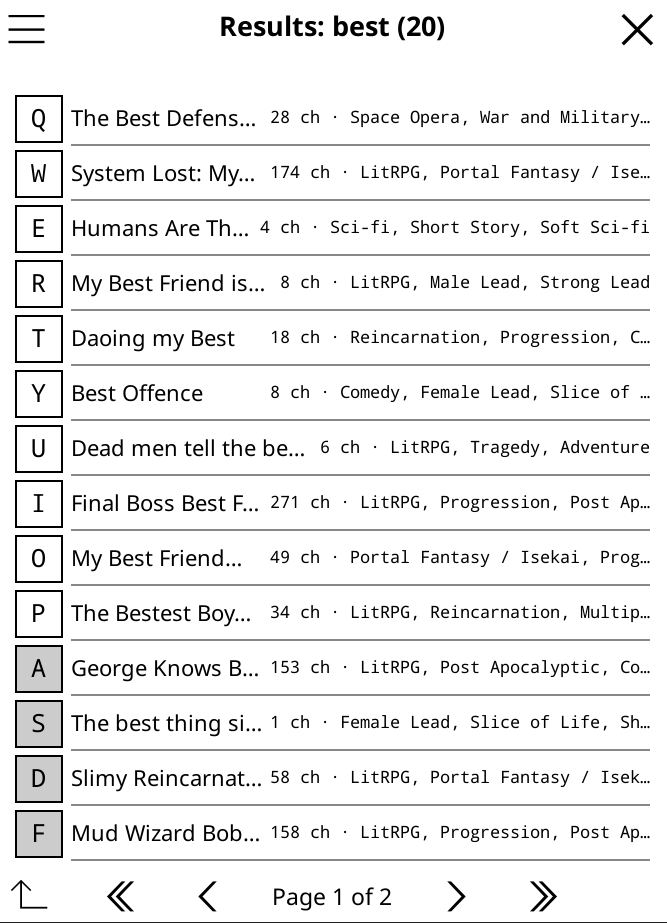
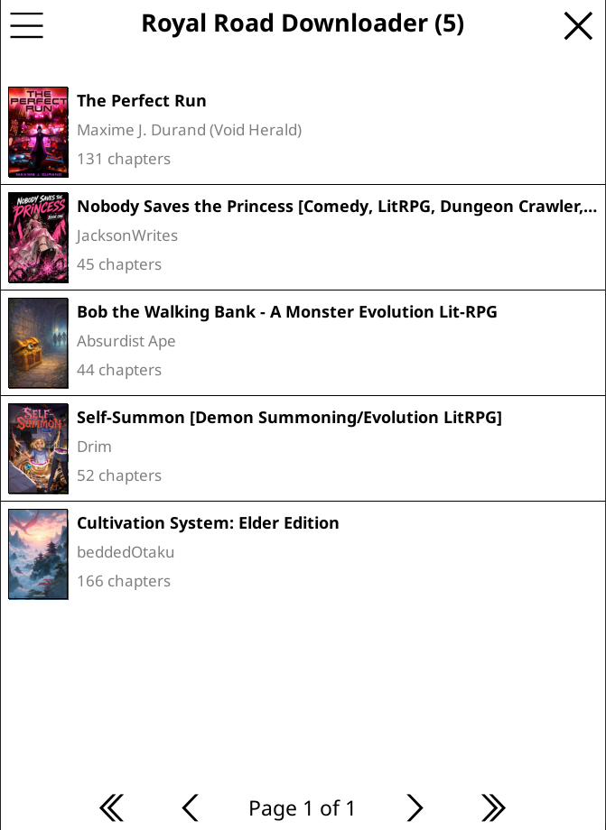
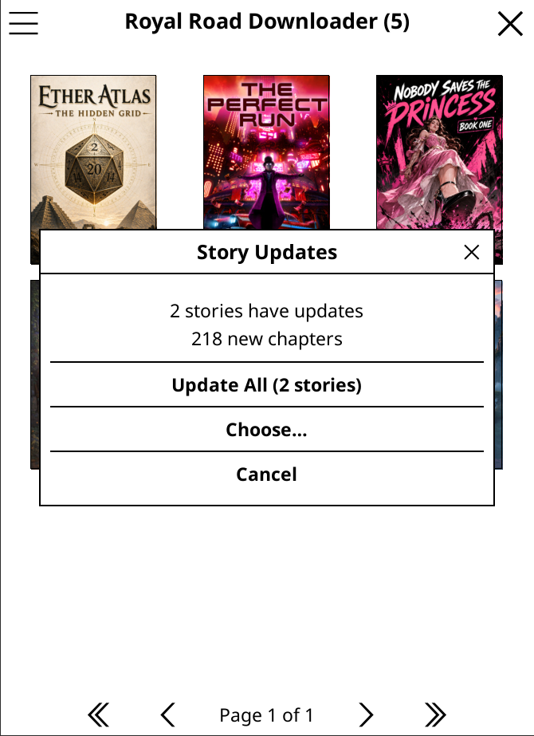
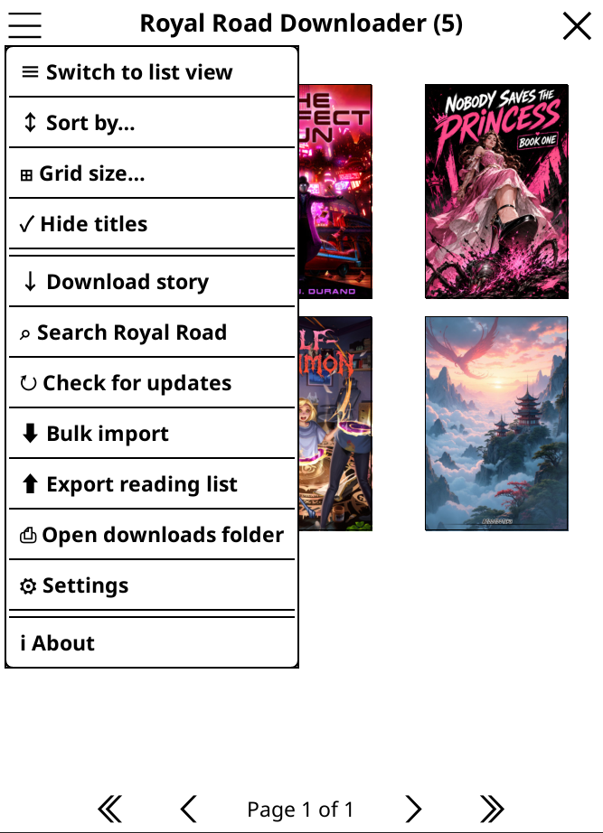
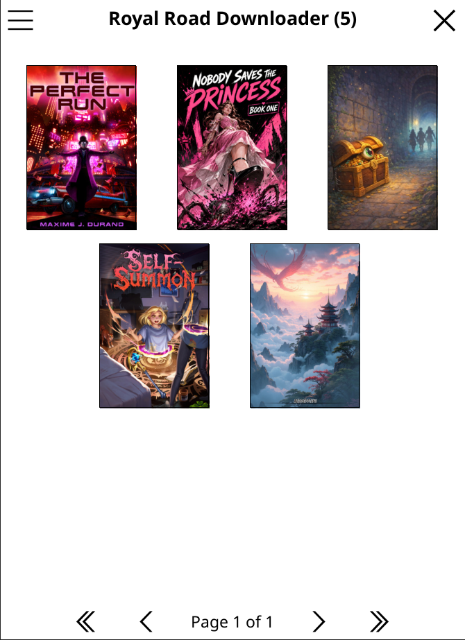
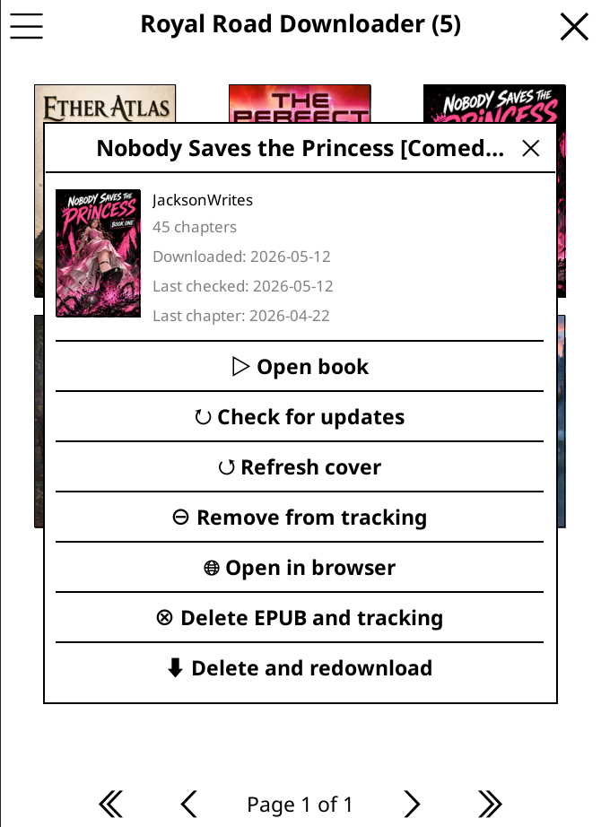

# Royal Road Downloader — KOReader Plugin

Download web fiction from [Royal Road](https://www.royalroad.com/) directly to your e-reader as EPUB files, ready to read offline.

<table><tr>
<td align="center"><br><sub><b>Search stories</b></sub></td>
<td align="center"><br><sub><b>Your library</b></sub></td>
<td align="center"><br><sub><b>Check for updates</b></sub></td>
</tr></table>

---

## What it does

Royal Road hosts thousands of free web novels. This plugin lets you download any story to your device in one tap — no computer needed. Stories are saved as EPUB files that KOReader can open, bookmark, and sync just like any other book.

**Key features:**

- Browse and search Royal Road without leaving your device
- Download complete stories or resume interrupted downloads
- Automatic updates — check for new chapters and add them to your existing EPUB
- Cover images, chapter titles, and author metadata included
- Respects Royal Road's servers with built-in rate limiting

---

## Installation

1. Download the latest release from the [Releases page](../../releases)
2. Copy the `royalroad.koplugin` folder into your KOReader plugins directory:

   | Device | Path |
   |--------|------|
   | Kobo | `/mnt/onboard/.adds/koreader/plugins/` |
   | Kindle | `/mnt/us/koreader/plugins/` |
   | Android | `/sdcard/koreader/plugins/` |
   | Linux / macOS | `~/.config/koreader/plugins/` |

3. Restart KOReader — the plugin appears under **Tools → Royal Road**

**Linux / macOS quick install:**

```bash
./install-plugin.sh
```

---

## Usage

### Searching for a story

Open the plugin via **Tools → Royal Road** to see all options.

<br><sub><b>Plugin menu</b></sub>

Search for a story by tapping **Search** and typing a title or author name. Results show rating, chapter count, and word count so you can judge a story before downloading.

<br><sub><b>Search results</b></sub>

Tap a result to see the full description, then tap **Download** to start.

### Downloading by ID

If you already know the story's URL, grab the ID from it:

```
https://www.royalroad.com/fiction/21220/mother-of-learning
                                   ^^^^^
                                   fiction ID
```

Go to **Tools → Royal Road → Download story**, enter the ID, and tap Download.

### Managing downloads

**Tools → Royal Road → My downloads** shows all your downloaded stories with cover images.

<br><sub><b>My downloads</b></sub>

From here you can:
- Open a story to read it
- Check for new chapters
- Re-download or delete a story
- Filter and sort your library

Tap a story to see per-story options.

<br><sub><b>Story options</b></sub>

### Updating stories

Tap **Check for updates** to scan all your downloaded stories for new chapters. Stories with updates are listed — tap **Update** to download the new chapters and merge them into the existing EPUB. Your reading position and bookmarks are preserved.

<br><sub><b>Update dialog</b></sub>

Interrupted or partial downloads are also detected and resumed automatically.

---

## Configuration

**Tools → Royal Road → Settings:**

| Setting | Default | Description |
|---------|---------|-------------|
| Download directory | `{KOReader data}/royalroad/` | Where EPUBs are saved |
| Rate limit delay | 1.5 s | Pause between chapter requests |
| Auto-add to collection | Off | Automatically adds every downloaded/updated story to a KOReader collection, so they can be browsed as a group (e.g. in a Simple UI collection widget) |
| Collection name | `Royal Road` | Name of the collection stories are auto-added to. Turning auto-add on, or changing this name, immediately backfills all existing downloads into that collection |

---

## Limitations

- No official API — relies on HTML scraping, which can break if Royal Road changes their site
- Paywalled / advanced chapters cannot be downloaded
- Large stories (1000+ chapters) take time — the progress bar shows ETA

---

## Development

See [`TESTING.md`](TESTING.md) for instructions on running the plugin from source.

---

*This plugin is not affiliated with Royal Road or KOReader. Use responsibly and respect Royal Road's [terms of service](https://www.royalroad.com/terms).*
